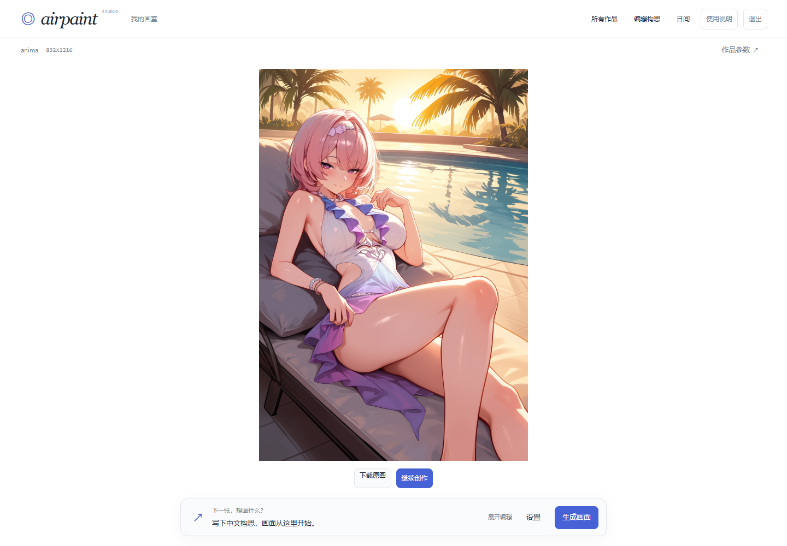

# AirPaint

AirPaint 是面向 ComfyUI 用户的 Prompt / Intent / Knowledge Intelligence Layer。它把中文画面意图、参考范围、LoRA 选择和生成参数编译成当前 Anima 工作流可执行的请求，同时保留可检查、可编辑的 Concept、Prompt、LoRA Binding 与 seed。

AirPaint 不替代 ComfyUI，也不是局部修图工具。当前版本进入封版维护：继续保留已经可用的 Prompt、参考图、整图重绘和历史分支能力，主动功能开发停止。



> 最后一次前端收尾后的界面实拍。中央图片是本项目已有生成结果；为在 GPU 与外部 API 不可用时仍可复核界面，任务和历史状态由本地演示夹具提供，不冒充本次实时生成。完整演示路径与证据边界见 [演示记录](docs/demo.md)。

## 使用流程

1. 用中文写清主体、画面重点和必须保留的条件，按需要选择补全程度、尺寸与 LoRA。
2. 先检查并编辑 Concept 和最终英文 Prompt，再把确认后的请求交给当前 Anima 工作流。
3. 在结果页保留真实 seed、尺寸、Prompt 与 LoRA Binding；刷新或重新登录后从服务端历史继续。
4. 想重新抽取构图时选“换一版”；允许整张图重新采样时选“基于此图重绘”，不要把它当作局部修图。

## 能做什么

- 用 `auto / faithful / free` 三档把中文构思编译成 Anima Prompt。
- 在生成前检查和编辑中文 Concept、十二字段 IR 与最终英文 Prompt。
- 选择角色/风格 LoRA Profile，由后端按 Registry 确定性绑定真实文件和 trigger。
- 用参考图借构图、构图＋氛围或完整可见信息。
- 用 Img2Img 对整张图片重新采样，选择 0.35/0.55/0.75 重绘强度和保留/裁切适配。
- 从历史图片换一版或建立重绘分支，并查看真实 seed、尺寸、Prompt、LoRA 与父任务。
- 在后端重启、浏览器刷新或短暂断线后恢复排队、核对已提交任务及重新取回已有结果。

## 项目贡献

AirPaint 的工作不在于替代底层生成器，而是把 ComfyUI 上方几个容易失真的环节连接成一条可检查、可恢复的链：

- 用 Concept、十二字段 IR、TAG/NL 分工和知识解析，把中文意图编译成 Anima 可执行 Prompt，同时保留人工编辑权。
- 将 LoRA Profile 的语义选择与真实文件、trigger、强度和单 Loader 注入分开，避免让语言模型猜工作流资源。
- 把参考观察、Prompt 编译、ComfyUI 提交、seed、历史分支和故障核对保存为同一个可追溯任务，而不是只留下最终图片。
- 用 SQLite、幂等请求、预分配 ComfyUI prompt ID、受控图片访问和一致性备份，让个人单机生成在刷新、断线和重启后仍能解释发生了什么。

两张由当前项目真实生成、并从 PNG 内嵌 workflow 核对参数的封版案例见 [真实案例与参数](docs/showcase.md)。其中也保留了没有完全实现参考范围的失败事实，案例不是画质宣传样板。

## 快速启动

当前保存环境为 Windows、Python 3.10.10、ComfyUI `127.0.0.1:8188`。

1. 安装 [requirements.txt](requirements.txt) 中固定的 Python 依赖。
2. 复制 `server/config.example.yaml` 为 `server/config.yaml`，填写本机路径、邀请码和 API key。该文件已被 Git 忽略。
3. 启动 ComfyUI。
4. 双击 `.tools/start_airpaint.bat`。只在本机使用时运行 `powershell -File .tools/start_airpaint.ps1 -NoTunnel`。
5. 打开 `http://127.0.0.1:8000` 或已配置的 `https://airpaint.xyz`。
6. 结束时双击 `.tools/stop_airpaint.bat`。它先请求后端正常关闭并写回数据库，超时才强制终止；不会关闭 ComfyUI。

缺少配置、workflow、LoRA Registry、ComfyUI 或 cloudflared 时，启动脚本会指出具体缺项。完整启动、停止、状态解释和备份恢复见 [运维说明](docs/operations.md)。

## 配置边界

```yaml
comfy_url: http://127.0.0.1:8188
comfy_dir: "E:/ComfyUI_windows_portable/ComfyUI"
host: 127.0.0.1
port: 8000
allow_origins: ["https://airpaint.xyz", "http://127.0.0.1:8000"]
tokens: ["friend-xxxx"]
daily_limit: 90
translate: siliconflow
siliconflow_model: "deepseek-ai/DeepSeek-V4-Flash"
siliconflow_vision_model: "Qwen/Qwen3-VL-8B-Instruct"
```

原始邀请码和 API key 只应出现在 `server/config.yaml`。业务数据库只保存由本机身份密钥生成的匿名 owner ID，请求快照会剔除鉴权字段。

人工维护的 LoRA 真相源是 `server/lora_registry.yaml`。新增资产继续使用 `.tools/start_lora_onboard_agent.bat`；服务启动不会扫描并自动收录全部 LoRA。

## 数据与恢复

- `server/state/airpaint.db` 是任务、会话、历史和每日用量的权威来源。
- `server/images/` 保存输出图，`server/state/source_images/` 保存迭代所需输入图。
- 浏览器只保存主题和短暂请求恢复标识，不再保存业务历史或原始邀请码。
- 生成图通过带归属校验的 `/api/images/{filename}` 读取，不存在公开 `/images` 目录旁路。
- 每个邀请码每天默认可创建 90 个生成任务。任务一旦与配额在同一事务中创建就计一次；参数校验失败不计；失败任务不退次数；刷新、同请求重试、状态核对和重新下载不重复计数。

在线一致性备份：

```text
python -m server.maintenance backup
python -m server.maintenance verify server/backups/<备份文件>.zip
```

恢复必须先停止 AirPaint：

```text
python -m server.maintenance restore server/backups/<备份文件>.zip --replace
```

备份同时包含 SQLite、身份密钥以及数据库实际引用的输入/输出图片；恢复覆盖前自动再做一份回滚备份。

## 验证

```text
python -m compileall -q server
node .tools/check_frontend.js
python .tools/test_prompt_unit.py
python .tools/test_image_iteration.py
python .tools/test_persistence_recovery.py
python .tools/test_lora_composition.py
python .tools/test_lora_onboard_agent.py
python .tools/register_lora.py --validate
python .tools/inspect_wf.py
```

这些检查证明协议、持久化、恢复、Binding 和 workflow 注入没有已知结构退化，不能证明每张图片的审美或 Img2Img 改动都会成功。

## 已知限制

- Img2Img 是整图重绘。低强度可能几乎不改，高强度可能连带改变人物、发型、服装和构图；它不保证“只改指定区域”。
- D59 的参考图/Img2Img 五张定向样本已完成工程核对，但图片人眼验收没有全部通过，不能写成画质完成。
- 双角色有确定性数量和 Prompt 语法护栏，复杂互动与属性归属仍受 Anima、LoRA 和 seed 影响；三角色只 best-effort。
- 单 worker、单机 SQLite、HTTP 轮询；不提供分布式调度、WebSocket、数据库集群或多 GPU 并发。
- 旧浏览器历史没有可验证的归属和参数，不能伪装成完整可恢复任务；原文件仍可作为普通旧图片保留。
- 当前单页界面的 Tailwind 与 GSAP 仍从外部 CDN 加载，字体使用本机系统字体；断网时业务数据不丢失，但样式或动效可能降级。离线查看项目可使用仓库内截图与演示记录。

## 文档入口

- [BUILDHANDOFF](docs/BUILDHANDOFF.md)：当前能力、证据、边界和接手路线。
- [架构](docs/architecture.md) / [API](docs/api.md) / [运维](docs/operations.md) / [演示记录](docs/demo.md) / [真实案例](docs/showcase.md)。
- [设计决定](docs/decisions.md) / [开发日志](docs/DEVLOG.md) / [Roadmap](ROADMAP.md)。
- [AGENTS.md](AGENTS.md)：仓库开发规约。

## 维护状态

`v1.0.0`（`9af5604`）为最终封版基线，旧 tag 保持不变。2026-09-09 按用户授权完成沉浸展台前端收尾，功能范围不扩展。此后只接受阻止正常使用的数据丢失、兼容或安全修复。Prompt 新方案、新模型、RAG、微调、多 Agent、自动改图、新 workflow、微服务和前端框架迁移都不属于当前维护范围。
