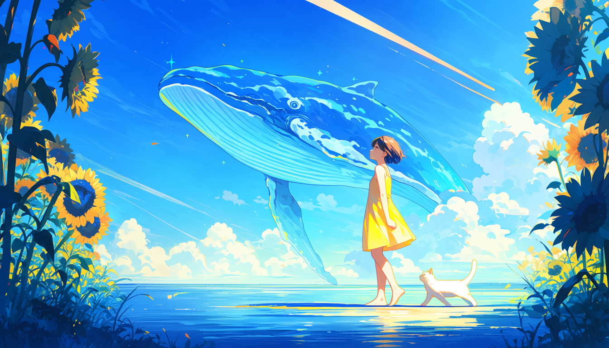
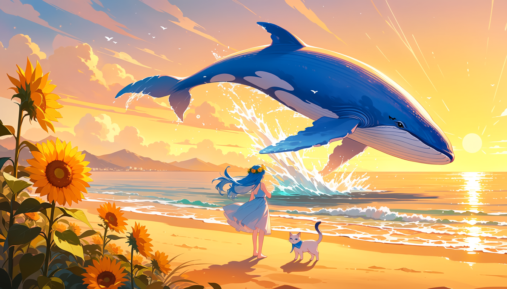

# AirPaint 真实案例与已有参数

这里保存两张由 AirPaint 当前 Anima 工作流真实生成的 SFW 图片。图片直接复制自本机原始结果，没有重新生成或后期编辑；参数从各 PNG 的内嵌 ComfyUI `prompt` JSON 核对，验收语义来自 D59 本地记录。

这两例用于证明项目可以保存可追溯的生成结果，不代表参考图或 Img2Img 已达到稳定画质。D59 五张定向样本的人眼结果没有全部通过，完整失败边界见 `docs/BUILDHANDOFF.md`。

## 案例一：构图与氛围参考



- 原任务：`299bcdd436`
- 生成方式：构图＋氛围参考后 txt2img
- 图片：`1344×768`
- 模型：`anima_baseV10.safetensors`
- LoRA：无
- seed：`1004945114`
- steps / CFG：`30 / 4.0`
- sampler / scheduler：`er_sde / simple`
- denoise：`1.0`
- SHA-256：`c70a1ccac713c5e1ae5d68951646ecfe3e2f2cad1be4a7bfd998aed01db0bb9a`

验收意图：短发、黄裙、垂手站在浅海、白猫在脚边、天空水鲸，并借用参考图的夏日构图与氛围。

实际正向 Prompt：

```text
masterpiece, best quality, newest, absurdres, 1girl, solo, short hair, yellow dress, standing in shallow sea water, arms hanging naturally at her sides, looking up at the sky, white cat walking beside her feet, transparent whale floating in the sky above, sunflowers framing the left foreground and upper right corner, low horizon line, bright summer sunlight, strong highlights on the whale and the girl's hair and dress, soft shadows on the reflective water surface, diagonal sun rays streaking across the sky from the upper right, whimsical serene dreamlike mood, vibrant blue and yellow palette, soft painterly textures with glowing highlights
```

结果事实：短发和黄裙覆盖生效，单画面、水鲸、白猫与主体关系清楚；向日葵仍从参考布局观察带入，因此参考范围不是完美语义隔离。

## 案例二：换一版



- 原任务：`2563f223c9`
- 生成方式：从父任务换一版；不重新调用 Composer，复用 Prompt/IR 并更换 seed
- 父任务：`cec5259858`
- 图片：`1344×768`
- 模型：`anima_baseV10.safetensors`
- LoRA：无
- seed：`328762716`
- steps / CFG：`30 / 4.0`
- sampler / scheduler：`er_sde / simple`
- denoise：`1.0`
- SHA-256：`1682d6383ef1cfd5cd1f44dff71f1904dc6e5dfe1f1c784e40db88d9094e22d8`

实际正向 Prompt：

```text
masterpiece, best quality, newest, absurdres, 1girl, solo, 1cat, 1whale, long flowing blue hair, flower crown, light blue dress, standing on sandy beach with back to viewer, facing the ocean, white cat with blue collar standing alert near her feet, large blue whale arched mid-leap above the ocean surface with water splashing from its mouth, sunflowers in the foreground left, distant mountains on the horizon, warm golden evening sunlight bathing the scene, golden light reflecting on the water, long soft shadows stretching across the sand, gentle magical peaceful atmosphere, anime illustration, vibrant color palette, smooth digital painting style
```

结果事实：新 seed 形成明显不同的夕阳构图，证明“换一版”是保留语义状态后重新抽取画面，不是保持原图像素的编辑。

## 两例共同负面 Prompt

```text
worst quality, low quality, lowres, score_1, score_2, score_3, blurry, jpeg artifacts, bad anatomy, bad hands, missing fingers, extra fingers, fused fingers, extra arms, extra legs, bad feet, malformed feet, watermark, artist name
```

PNG 内还保留完整 ComfyUI workflow metadata；文档没有把旧浏览器历史或无法验证的演示字段补写成真实参数。
